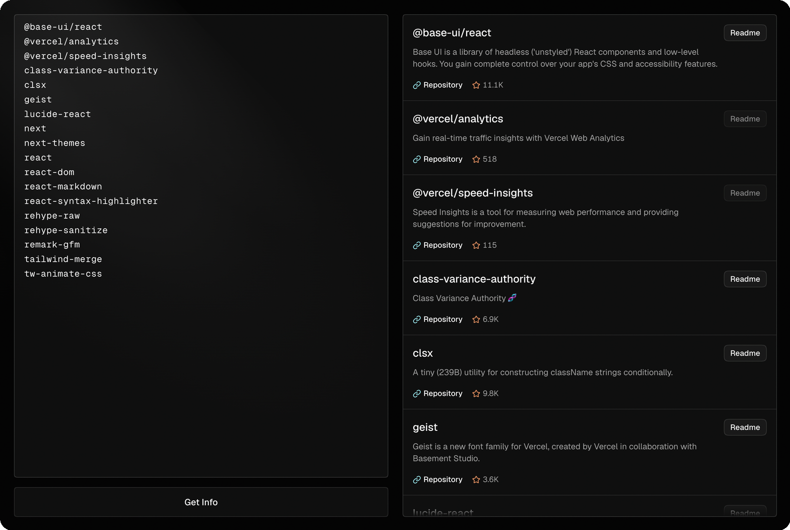

# Library Info

Look up npm packages by name or dependency list. Each result shows the package description, repository stars, and README.



## Development

Requirements:

- Node.js 20.9 or later
- pnpm 10 (`corepack enable`)

```bash
git clone https://github.com/guisarria/library-info.git
cd library-info
pnpm install
pnpm dev
```

The app runs at [http://localhost:3000](http://localhost:3000). No environment variables are required.

### Scripts

| Command          | Description                     |
| ---------------- | ------------------------------- |
| `pnpm dev`       | Start the development server    |
| `pnpm build`     | Build for production            |
| `pnpm start`     | Serve the production build      |
| `pnpm lint`      | Check code with Biome           |
| `pnpm format`    | Fix lint and formatting issues  |
| `pnpm typecheck` | Run the TypeScript compiler     |

A pre-commit hook (Lefthook) runs `ultracite fix` on staged files. It is installed with `pnpm install`.
